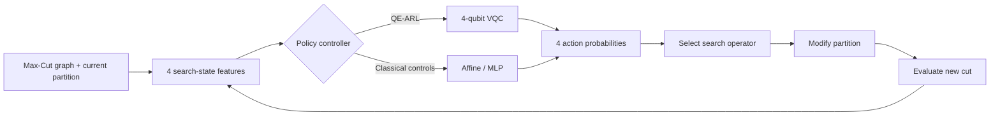

# QE-ARL: Quantum-Enhanced Agentic Reinforcement Learning for Max-Cut

A reproducibility-oriented Google Colab implementation of **Quantum-Enhanced Agentic Reinforcement Learning (QE-ARL)** for the Max-Cut problem. The notebook studies whether a compact variational quantum circuit (VQC) can act as a learned **meta-policy** that selects classical graph-search operators from a small set of search-state features.

The project emphasizes controlled comparison, reproducibility, and conservative interpretation. It includes parameter-matched nonlinear classical policies, multiple training seeds, exact verification on small graphs, finite-shot simulation, gradient validation, larger weighted/unweighted stress tests, QAOA benchmarking, and zero-shot evaluation on genuine Stanford Gset instances.

> **Scope:** This repository contains simulation-based research code. It does **not** claim quantum advantage or quantum speedup, and it does not report execution on quantum hardware.

---

## Notebook

The main executable file is:

```text
QE_ARL_Colab_FINAL_File.ipynb
```

The notebook is designed to run from top to bottom in a fresh **Google Colab** session using **Runtime -> Run all**.

---

## What QE-ARL does

QE-ARL does not directly encode the complete graph into a quantum circuit. Instead, it uses a fixed **4-qubit VQC as an agentic search controller**.

At each search step, the environment summarizes the current Max-Cut search state using four bounded features. A policy converts those features into probabilities over four classical search actions. The selected action modifies the current binary partition, the cut is re-evaluated, and the process repeats.



### Search-state features

The controller receives four normalized features:

1. current cut quality;
2. best cut found so far;
3. normalized stall duration;
4. normalized mean single-flip gain.

For ordinary unweighted graphs, cut-quality terms are normalized by the number of edges. For positive weighted graphs, the same formulation uses total edge weight. Signed Gset instances use a bounded normalization derived from the theoretical cut-weight interval.

### Available search actions

The policy chooses among four operators:

| Action | Search operator | Description |
|---|---|---|
| 0 | Best one-bit flip | Flips the vertex with the largest immediate gain. |
| 1 | Gain-biased stochastic flip | Samples a vertex using a soft gain-based probability distribution. |
| 2 | Pair flip | Flips two vertices selected from the four highest-gain candidates. |
| 3 | Structured perturbation | Flips approximately 20% of the vertices to encourage exploration. |

---

## QE-ARL quantum policy

The QE-ARL policy is a **4-qubit, 8-trainable-parameter variational quantum circuit** implemented directly with NumPy statevectors.

For the four input features `f_0, ..., f_3`, the circuit performs:

1. feature encoding with `RY(pi * f_q)` on each qubit;
2. a ring of CNOT entanglers;
3. a trainable `RY` layer with four parameters;
4. a second ring of CNOT entanglers;
5. a second trainable `RY` layer with four parameters;
6. Pauli-Z expectation values on the four qubits;
7. softmax conversion of the four expectation-derived logits into action probabilities.

This gives QE-ARL exactly **8 trainable VQC parameters**.

> The quantum simulation is implemented from first principles with NumPy. The notebook does not require Qiskit or PennyLane.

---

## Classical comparison policies

The notebook trains QE-ARL under the same search environment and training protocol as three learned classical controllers.

| Method | Parameters | Structure |
|---|---:|---|
| `QE-ARL` | 8 | 4-qubit VQC with two trainable RY layers |
| `MLP8-ARL` | 8 | Parameter-matched nonlinear `4 -> 1 -> 4` tanh MLP |
| `MLP20-ARL` | 20 | Nonlinear `4 -> 2 -> 4` tanh MLP |
| `Affine-ARL` | 20 | Affine `4 -> 4` softmax controller |

Two non-learned search references are also used in the main exact benchmark:

- `Greedy`
- `Random`

The 8-parameter MLP is especially important because it provides a nonlinear classical baseline with the **same number of trainable parameters as QE-ARL**.

---

## Training protocol

All learned policies use the same episodic Max-Cut search protocol.

| Setting | Value |
|---|---|
| Training graph family | Unweighted Erdos-Renyi |
| Training graph size | `n = 10` |
| Training edge probability | `p = 0.5` |
| Training seeds | `11, 23, 37, 41, 53` |
| Episodes per seed | `80` |
| Search horizon | `20` steps |
| Discount factor | `0.95` |
| Learning rate | `0.05` |
| Optimizer | Adam-style parameter update |

The reward combines normalized change in cut value, a small bonus when a new best cut is found, and a small per-step penalty. The best cut obtained in the episode is also incorporated into the terminal reward.

For QE-ARL training, the log-policy gradient is estimated using a **single-direction simultaneous perturbation (SPSA-style) estimator**. The notebook later validates this training-style estimator against parameter-shift gradients on held-out policy states.

---

## Experimental workflow

### 1. Exact small-graph benchmark

The primary controlled benchmark uses **72 unseen Erdos-Renyi graphs**:

- graph sizes: `n = 8, 10, 12`;
- edge probabilities: `p = 0.3, 0.5, 0.7`;
- 8 graph instances for every `(n, p)` setting.

For these graphs, the true Max-Cut optimum is computed by exhaustive enumeration with complement symmetry removed by fixing the first partition bit.

Each trained model seed is evaluated with three repeated search runs. The notebook reports:

- approximation ratio to the exact optimum;
- exact-optimum hit rate;
- mean runtime;
- bootstrap 95% confidence intervals;
- paired QE-ARL differences against the comparison methods;
- win, tie, and loss rates.

This is the only section in which the reported denominator is a certified exact optimum.

### 2. Finite-shot VQC robustness

QE-ARL inference is evaluated under:

- exact statevector expectation values;
- `1,000` simulated measurement shots;
- `8,000` simulated measurement shots.

The environment seed is paired across modes so that finite-shot results can be compared directly with exact-statevector inference.

This experiment models **measurement sampling noise only**. It does not simulate gate noise, device calibration, connectivity constraints, transpilation, decoherence, or other hardware effects.

### 3. SPSA gradient validation

The notebook compares the training-style QE-ARL gradient estimator with an analytic parameter-shift reference.

Validation is performed on held-out policy states collected from test graphs. Two estimators are reported:

- `Training-style SPSA-1`: one simultaneous perturbation direction;
- `SPSA-8avg`: the average of eight perturbation directions.

Reported diagnostics include:

- relative L2 error;
- cosine similarity;
- mean absolute error;
- estimated and reference gradient norms.

### 4. Scale and weighted stress tests

Larger graphs use:

- `n = 16, 20, 24`;
- `p = 0.3, 0.5, 0.7`;
- three graph instances per setting.

Two graph families are tested:

1. unweighted Erdos-Renyi graphs;
2. positive integer-weighted Erdos-Renyi graphs with weights sampled from `1..10`.

Because exhaustive Max-Cut verification is no longer used at these sizes, the denominator is a **feasible heuristic reference**, obtained from a high-budget multi-start iterated local search:

- 300 random restarts;
- steepest-ascent local search;
- three perturb-and-reclimb phases per restart.

Therefore, values in this section are reported as:

```text
found_cut / heuristic_reference_cut
```

They must **not** be described as certified approximation ratios. A tested method can legitimately exceed this heuristic reference because the reference is a feasible lower bound, not a proof of optimality.

### 5. QAOA benchmark

A separate statevector QAOA experiment is run on all 72 exact-verification graphs.

| Setting | Value |
|---|---|
| QAOA depth | `p = 2` |
| Optimizer | Nelder-Mead |
| Random restarts | `3` |
| Maximum iterations | `80` |
| Simulated samples | `1,000` |

QAOA `p = 2` is used because QE-ARL contains two trainable variational RY layers. This is only a **variational-layer comparison**; it does not imply matched gate count, qubit count, or physical circuit depth.

For each graph, the notebook reports:

- expected cut;
- expected-cut ratio to the exact optimum;
- analytic probability mass on optimum bitstrings;
- best cut found in 1,000 simulated samples.

QAOA is reported separately from the agentic-RL table because QAOA directly optimizes a graph-dependent quantum state distribution, whereas QE-ARL is a fixed-size meta-policy that selects classical search operators.

### 6. Genuine Gset zero-shot transfer

The final benchmark evaluates the learned policies on six standard Gset instances without any Gset training.

| Instance | Vertices | Edges | Weights | Structure | Stored target / best-known value |
|---|---:|---:|---|---|---:|
| G1 | 800 | 19,176 | +1 | random | 11,624 |
| G6 | 800 | 19,176 | +/-1 | random | 2,178 |
| G11 | 800 | 1,600 | +/-1 | toroidal | 564 |
| G14 | 800 | 4,694 | +1 | planar | 3,064 |
| G18 | 800 | 4,694 | +/-1 | planar | 992 |
| G22 | 2,000 | 19,990 | +1 | random | 13,359 |

The notebook:

1. downloads each raw instance from Yinyu Ye's Stanford Gset archive;
2. uses a public GitHub mirror only as a fallback;
3. validates the expected vertex and edge counts;
4. calculates a SHA-256 digest for every downloaded source file;
5. evaluates the previously trained policies for 200 search steps;
6. reports cut values relative to the stored published target/best-known values.

These denominators are **best-known or target values, not mathematically proven optima**.

---

## Reproducibility controls

The notebook includes several safeguards intended to make the reported results auditable:

- fixed seeds for training, held-out graph generation, finite-shot simulation, QAOA initialization, and other evaluation components;
- five independent training seeds;
- parameter-matched classical controls;
- paired evaluation where applicable;
- exact verification for small graphs;
- bootstrap confidence intervals;
- explicit separation between exact optima, heuristic references, and published Gset targets;
- source validation and SHA-256 hashing for Gset data;
- an exported `run_manifest.json` recording the main experiment configuration;
- end-of-run sanity assertions checking graph count, ratio ranges, shot modes, QAOA depth, Gset coverage, and signed-weight inclusion.

---

## Requirements

The notebook uses standard scientific Python packages available in Google Colab:

```text
numpy
pandas
matplotlib
scipy
```

It also uses Python standard-library modules including `pathlib`, `time`, `json`, `math`, `hashlib`, `zipfile`, and `urllib.request`.

A local environment can install the scientific dependencies with:

```bash
pip install numpy pandas matplotlib scipy
```

An internet connection is required during the Gset stage because the benchmark files are downloaded at runtime.

---

## Running the notebook

### Google Colab

1. Upload or open `QE_ARL_Colab_FINAL_File.ipynb` in Google Colab.
2. Select **Runtime -> Run all**.
3. Allow the notebook to complete all training and evaluation sections.
4. Inspect the generated figures, summary tables, and sanity-check message.
5. Retrieve the generated artifacts from the `artifacts/` directory.

### Local Jupyter

```bash
jupyter notebook QE_ARL_Colab_FINAL_File.ipynb
```

Then run all cells in order.

> The exact Max-Cut and statevector QAOA routines scale exponentially with graph size. They are intentionally restricted to the small exact-verification benchmark.

---

## Generated artifacts

The notebook creates an `artifacts/` directory and exports the following analysis files.

### CSV results

```text
training_history_5seeds.csv
main_results_exact_72graphs.csv
main_summary_exact_72graphs.csv
paired_QE_differences.csv
shot_noise_results.csv
shot_noise_summary.csv
shot_noise_paired.csv
spsa_parameter_shift_validation.csv
large_scale_unweighted.csv
large_scale_weighted.csv
qaoa_p2_full72.csv
gset_sources_sha256.csv
gset_results.csv
gset_summary.csv
```

### Figures

```text
training_curves_revised.png
exact_ratio_by_size_revised.png
shot_noise_robustness.png
```

### Reproducibility metadata

```text
run_manifest.json
```

### Packaged results

```text
QE_ARL_complete_revision_results.zip
```

The notebook also downloads raw Gset files into:

```text
artifacts/gset_raw/
```

The current ZIP-building cell packages the **root-level files** in `artifacts/`; the nested `gset_raw/` directory itself is not added to the ZIP. The source URL and SHA-256 digest for each Gset file are nevertheless preserved in `gset_sources_sha256.csv`.

---

## How to interpret the results correctly

The notebook deliberately uses different reference types for different experimental regimes.

| Experiment | Reference denominator | Correct interpretation |
|---|---|---|
| `n = 8, 10, 12` | Exact Max-Cut optimum | Exact approximation ratio |
| `n = 16, 20, 24` | Strong feasible heuristic cut | Ratio to heuristic reference |
| Gset | Published target / best-known value | Ratio to published target |
| Finite-shot QE-ARL | Same exact small-graph optimum | Sampling-robustness comparison |
| QAOA | Exact small-graph optimum | Statevector QAOA benchmark |

The following claims should **not** be made from this notebook alone:

- quantum advantage;
- quantum speedup;
- hardware superiority;
- noise resilience on a physical quantum processor;
- certified approximation ratios for the large-scale heuristic-reference tests;
- proof that stored Gset targets are global optima.

---

## Methodological references

The notebook is informed by the following benchmarking and optimization references:

1. A. Abbas et al., **“Challenges and opportunities in quantum optimization,”** *Nature Reviews Physics*, 6, 718-735 (2024). https://doi.org/10.1038/s42254-024-00770-9
2. M. Willsch et al., **“Benchmarking the quantum approximate optimization algorithm,”** *Quantum Information Processing*, 19, 197 (2020). https://doi.org/10.1007/s11128-020-02692-8
3. K. Blekos et al., **“A review on Quantum Approximate Optimization Algorithm and its variants,”** *Physics Reports*, 1068, 1-66 (2024). https://doi.org/10.1016/j.physrep.2024.03.002
4. J. C. Spall, **“Multivariate stochastic approximation using a simultaneous perturbation gradient approximation,”** *IEEE Transactions on Automatic Control*, 37(3), 332-341 (1992). https://doi.org/10.1109/9.119632
5. M. Schuld, V. Bergholm, C. Gogolin, J. Izaac, and N. Killoran, **“Evaluating analytic gradients on quantum hardware,”** *Physical Review A*, 99, 032331 (2019). https://doi.org/10.1103/PhysRevA.99.032331
6. Y. Ye, **Gset benchmark archive**, Stanford University. https://web.stanford.edu/~yyye/yyye/Gset/
7. N. Onizawa and T. Hanyu, **“A unified performance-cost landscape of parallel p-bit Ising machines based on update dynamics,”** *Scientific Reports*, 16, 16643 (2026). https://doi.org/10.1038/s41598-026-47285-0

---

## Research-use note

For manuscript reporting, numerical values should be taken directly from the exported CSV files generated by the specific run being reported. This README describes the implemented methodology and experiment design; it intentionally avoids hard-coding headline performance numbers that could become inconsistent with a newly executed run.

When publishing results, keep the distinction between **exact optimum**, **heuristic reference**, and **published best-known target** explicit in tables, captions, and discussion.

---

## Repository status

This notebook is intended as the reproducibility implementation for the QE-ARL Max-Cut experimental study. If the experimental protocol changes, update both the notebook and this README so that the repository continues to describe the code that is actually executed.
